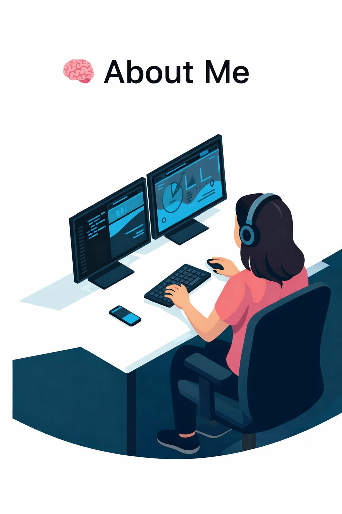

  

<h3 align="center">💖 Full Stack Developer | Java & MERN Stack 💻</h3>

  

  

---

<h1 align="center">
  
</h1>

---

  

✨ MCA Student & Full Stack Developer  

I build modern and user-friendly web applications using 
<strong>Java (Core & Advanced)</strong> and the <strong>MERN Stack</strong>.  

🎯 Currently working on a <strong>Web Conferencing App</strong> 
using Node.js, MongoDB, and real-time technologies.  

I believe in learning by building real projects and improving step by step every day 🚀

---

## 🛠 Technical Stack

---

### 🎨 Frontend Development

  

---

### ☕ Backend Development

  

---
### 🗄 Databases

  
  &nbsp;&nbsp;&nbsp;
  
  &nbsp;&nbsp;&nbsp;
  

 
<h2 align="center">💼 Work Experience</h2>

<table align="center" width="90%" cellpadding="12" cellspacing="0">
<tr style="background-color:#e0bbff;">
<th>🏢 Organization</th>
<th>💻 Role</th>
<th>⏳ Duration</th>
<th>🚀 Work</th>
</tr>

<tr style="background-color:#f5e6ff;">
<td><b>Taurus Glocal Consulting Services Pvt. Ltd.</b></td>
<td>Full Stack Developer Intern</td>
<td>Decmber 2025 – Present</td>
<td>
Real-Time Web Conferencing App (MERN Stack) 
Backend APIs • Video Call Integration • Database Management
</td>
</tr>
</table>
<h2 align="center">🎓 Education</h2>

<table align="center" width="80%" style="border-collapse: collapse;">

<tr style="background-color:#f8f9fa;">
<th align="left" style="padding:10px;">Degree</th>
<th align="left" style="padding:10px;">College</th>
<th align="left" style="padding:10px;">Session</th>
</tr>

<tr style="background-color:#ffffff;">
<td style="padding:10px;"><b>MCA</b></td>
<td style="padding:10px;">Patna Women's College, Patna University</td>
<td style="padding:10px;">2024 – 2026</td>
</tr>

<tr style="background-color:#f1f3f5;">
<td style="padding:10px;"><b>BCA</b></td>
<td style="padding:10px;">GJ College, Rambagh Bihta 
<i>Built a strong foundation in computer applications</i></td>
<td style="padding:10px;">2021 – 2024</td>
</tr>

</table>

## 🚀 Projects

🔹 🎥 [Web Conferencing App](https://github.com/alpana59/web-conferencing-app)  
🔹 🏫 [School Website](https://github.com/alpana59/school-website)  
🔹 📝 [Tech Blog](https://github.com/alpana59/TechBlog)  
🔹 🛒 E-Shop (MERN) – Coming Soon 🚧  

---

## 📊 GitHub Stats

  

  

  

---

  💕 Thanks for visiting my profile 💕

